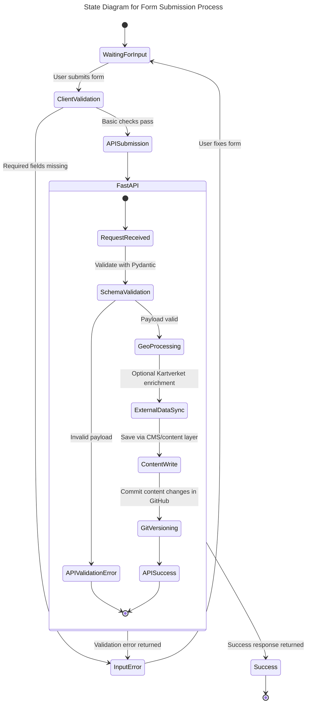

```mermaid
---
title: State Diagram for Form Submission Process
---
stateDiagram-v2
    [*] --> WaitingForInput

    WaitingForInput --> ClientValidation : User submits form

    ClientValidation --> InputError : Required fields missing
    InputError --> WaitingForInput : User fixes form

    ClientValidation --> APISubmission : Basic checks pass

    state FastAPI {
        [*] --> RequestReceived
        RequestReceived --> SchemaValidation : Validate with Pydantic

        SchemaValidation --> APIValidationError : Invalid payload
        APIValidationError --> [*]

        SchemaValidation --> GeoProcessing : Payload valid
        GeoProcessing --> ExternalDataSync : Optional Kartverket enrichment
        ExternalDataSync --> ContentWrite : Save via CMS/content layer
        ContentWrite --> GitVersioning : Commit content changes in GitHub
        GitVersioning --> APISuccess
        APISuccess --> [*]
    }

    APISubmission --> FastAPI
    FastAPI --> Success : Success response returned
    FastAPI --> InputError : Validation error returned

    Success --> [*]
```