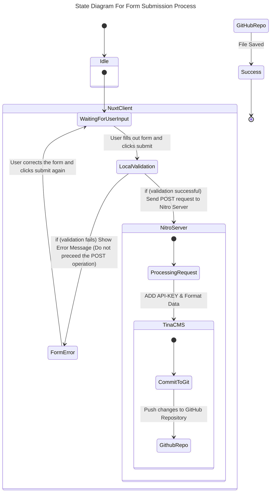

```mermaid
---
title: State Diagram For Form Submission Process
---
stateDiagram-v2
[*] --> Idle
state Idle {
    [*] --> WaitingForUserInput
    WaitingForUserInput --> LocalValidation : User fills out form and clicks submit

}

state NuxtClient {
    LocalValidation --> FormError: if (validation fails) Show Error Message (Do not preceed the POST operation)
    FormError --> WaitingForUserInput: User corrects the form and clicks submit again
    LocalValidation --> NitroServer: if (validation successful) Send POST request to Nitro Server
}
state NitroServer {
    [*] --> ProcessingRequest
    ProcessingRequest --> TinaCMS: ADD API-KEY & Format Data
}
state TinaCMS {
    [*] --> CommitToGit
    CommitToGit --> GithubRepo: Push changes to GitHub Repository
}

GitHubRepo --> Success : File Saved
Success --> [*]
```