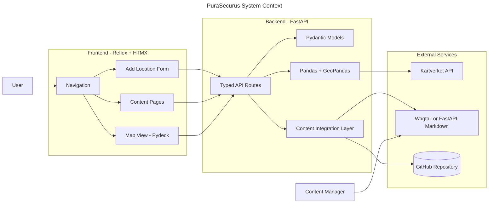

```mermaid
---
title: "PuraSecurus System Context"
---
graph LR

    User[User]
    Admin[Content Manager]

    subgraph Frontend[Frontend - Reflex + HTMX]
        Nav[Navigation]
        Pages[Content Pages]
        Form[Add Location Form]
        MapView[Map View - Pydeck]
    end

    subgraph Backend[Backend - FastAPI]
        Routes[Typed API Routes]
        Validation[Pydantic Models]
        GeoEngine[Pandas + GeoPandas]
        ContentAPI[Content Integration Layer]
    end

    subgraph DataSources[External Services]
        Kart[Kartverket API]
        CMS[Wagtail or FastAPI-Markdown]
        GitHub[(GitHub Repository)]
    end

    User --> Nav
    Nav --> Pages
    Nav --> Form
    Nav --> MapView

    Form --> Routes
    Pages --> Routes
    MapView --> Routes

    Routes --> Validation
    Routes --> GeoEngine
    GeoEngine --> Kart

    Routes --> ContentAPI
    ContentAPI --> CMS
    ContentAPI --> GitHub

    Admin --> CMS
```