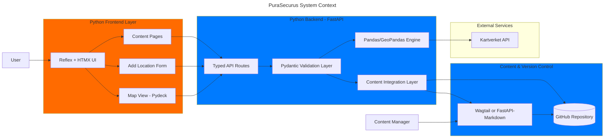

```mermaid
---
title: "PuraSecurus System Context"
---
graph LR

    User[User]
    Admin[Content Manager]

    subgraph PythonFrontend[Python Frontend Layer]
        UI[Reflex + HTMX UI]
        Pages[Content Pages]
        Form[Add Location Form]
        MapView[Map View - Pydeck]
    end

    subgraph BackendCore[Python Backend - FastAPI]
        Routes[Typed API Routes]
        Validation[Pydantic Validation Layer]
        GeoEngine[Pandas/GeoPandas Engine]
        ContentLayer[Content Integration Layer]
    end

    subgraph ContentManagement[Content & Version Control]
        CMS[Wagtail or FastAPI-Markdown]
        GitHub[(GitHub Repository)]
    end

    subgraph ExternalServices[External Services]
        Kart[Kartverket API]
    end

    User --> UI
    UI --> Pages
    UI --> Form
    UI --> MapView

    Pages --> Routes
    Form --> Routes
    MapView --> Routes

    Routes --> Validation
    Validation --> GeoEngine
    Validation --> ContentLayer

    GeoEngine --> Kart
    
    ContentLayer --> CMS
    ContentLayer --> GitHub
    
    Admin --> CMS
    CMS --> GitHub

    style PythonFrontend fill:#FF6B00
    style BackendCore fill:#007BFF
    style ContentManagement fill:#007BFF
```