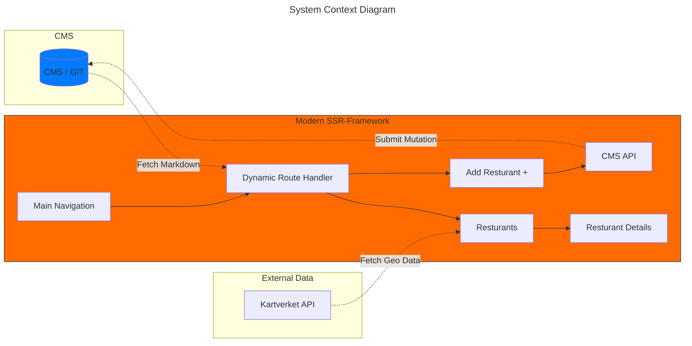

```mermaid
---
title: "System Context Diagram"
---
graph LR

    %% Participants
    CMS[External Data]
    Tina[(CMS / GIT)]
    NAV[Main Navigation]
    Router[Dynamic Route Handler]

    LP[Resturants]
    AR[Add Resturant +]
    D[Resturant Details]
    API[CMS API]
    EAPI[Kartverket API]

    subgraph CMS
        Tina
    end

    subgraph ExternalAPI[External Data]
        EAPI
    end

    subgraph Nuxt[Modern SSR-Framework]
        NAV --> Router
        Tina -.-> |Fetch Markdown| Router
        Router --> LP
        LP --> D
        EAPI -.-> |Fetch Geo Data| LP

        Router --> AR
        AR --> API
        API -.-> |Submit Mutation| Tina
    end

    %% styles
    style Tina fill: #007BFF
    style Nuxt fill:#FF6B00,stroke:#333
```