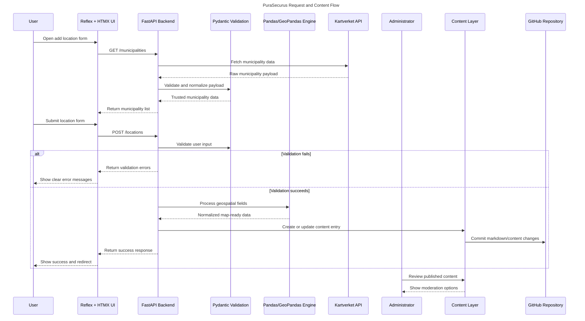

```mermaid
---
title: PuraSecurus Request and Content Flow
---
sequenceDiagram
    participant User
    participant UI as Reflex + HTMX UI
    participant API as FastAPI Backend
    participant VAL as Pydantic Validation
    participant GEO as Pandas/GeoPandas Engine
    participant KART as Kartverket API
    participant ADMIN as Administrator
    participant CMS as Content Layer
    participant GIT as GitHub Repository

    User ->> UI: Open add location form
    UI ->> API: GET /municipalities
    API ->> KART: Fetch municipality data
    KART -->> API: Raw municipality payload
    API ->> VAL: Validate and normalize payload
    VAL -->> API: Trusted municipality data
    API -->> UI: Return municipality list

    User ->> UI: Submit location form
    UI ->> API: POST /locations
    API ->> VAL: Validate user input

    alt Validation fails
        API -->> UI: Return validation errors
        UI -->> User: Show clear error messages
    else Validation succeeds
        API ->> GEO: Process geospatial fields
        GEO -->> API: Normalized map-ready data
        API ->> CMS: Create or update content entry
        CMS ->> GIT: Commit markdown/content changes
        API -->> UI: Return success response
        UI -->> User: Show success and redirect
    end

    ADMIN ->> CMS: Review published content
    CMS -->> ADMIN: Show moderation options
```