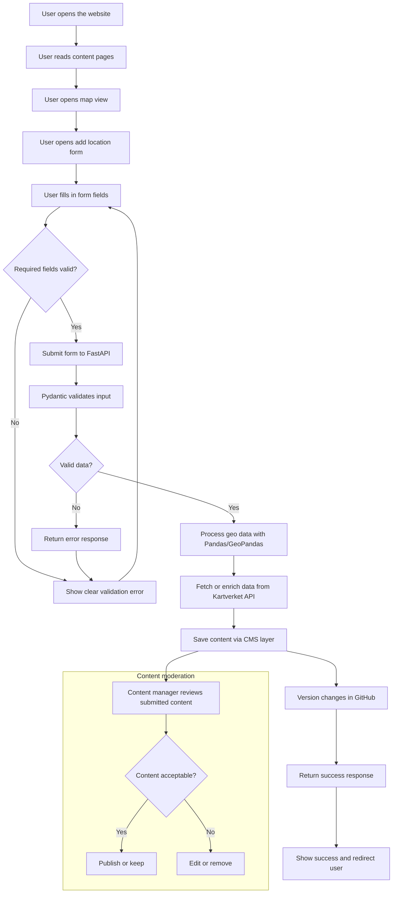

```mermaid
flowchart TD
    A[User opens the website] --> B[User reads content pages]
    B --> C[User opens map view]
    C --> D[User opens add location form]
    D --> E[User fills in form fields]

    E --> F{Required fields valid?}
    F -->|No| G[Show clear validation error]
    G --> E

    F -->|Yes| H[Submit form to FastAPI]
    H --> I[Pydantic validates input]
    I --> J{Valid data?}

    J -->|No| K[Return error response]
    K --> G

    J -->|Yes| L[Process geo data with Pandas/GeoPandas]
    L --> M[Fetch or enrich data from Kartverket API]
    M --> N[Save content via CMS layer]
    N --> O[Version changes in GitHub]
    O --> P[Return success response]
    P --> Q[Show success and redirect user]

    subgraph Moderation[Content moderation]
        R[Content manager reviews submitted content]
        S{Content acceptable?}
        T[Publish or keep]
        U[Edit or remove]
        R --> S
        S -->|Yes| T
        S -->|No| U
    end

    N --> R
```