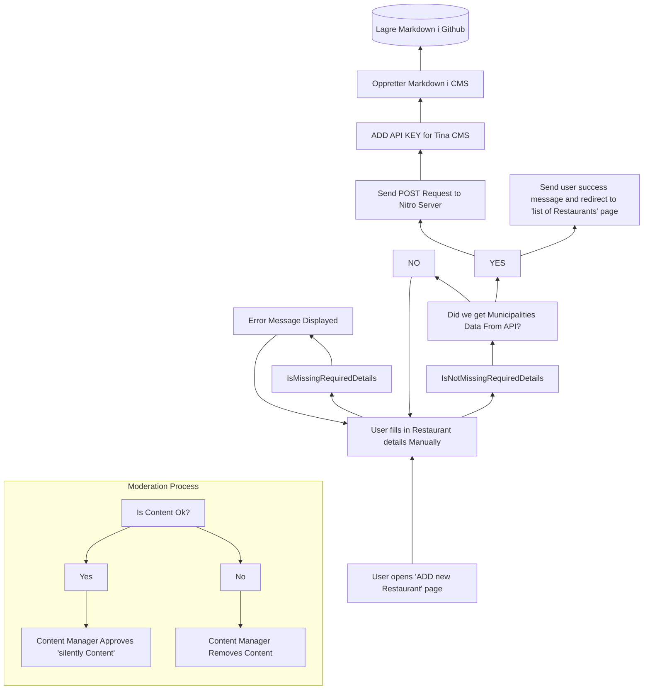

```mermaid
flowchart BT
    A[User opens 'ADD new Restaurant' page] --> B[User fills in Restaurant details Manually]
    B --> IsMissingRequiredDetails --> C[Error Message Displayed]
    C --> B

    B --> IsNotMissingRequiredDetails --> D[Did we get Municipalities Data From API?]
    D --> NO --> B


    D --> YES --> E[Send POST Request to Nitro Server]
    YES --> I[ Send user success message and redirect to 'list of Restaurants' page]
    E --> F[ADD API KEY for Tina CMS]
    F --> G[Oppretter Markdown i CMS]
    G --> H[(Lagre Markdown i Github)]

    subgraph Moderation[Moderation Process]
    J[Is Content Ok?] --> Yes --> K[Content Manager Approves 'silently Content']
    J --> No --> L[Content Manager Removes Content]
    end
```